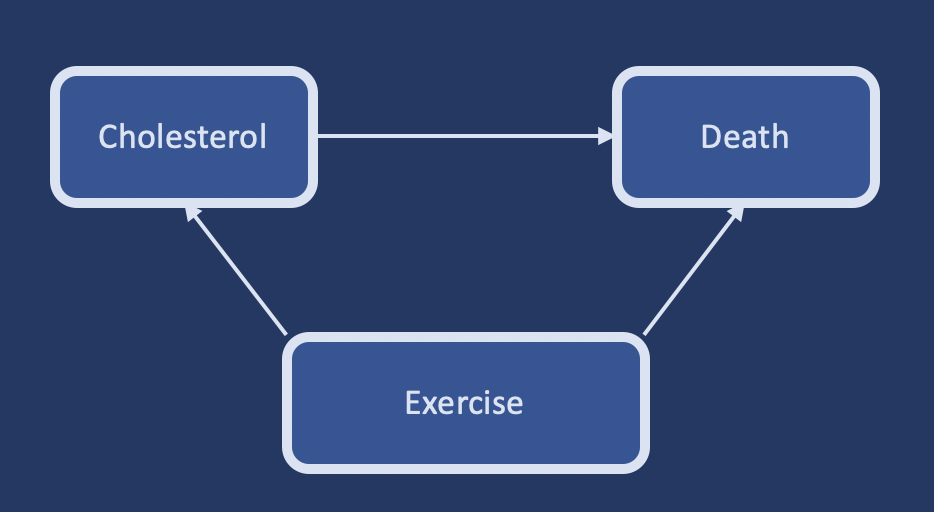

```{r setup, include=FALSE}
knitr::opts_chunk$set(echo = TRUE)

library("broom")
library("simstudy")
library("epitools")
library("gridExtra")
library("tidyverse")
library("data.table")

# library(epiR)
# library(tableone)
# library(ipw)
# library(sandwich) #for robust variance estimation
# library(survey)
# library(haven)
# library(EValue)
```

## Confounders

**confounders** vs **counterfactuals**

[here for a fun intuition on counterfactuals](https://www.youtube.com/watch?v=0lpY0Kt4bn8)

A **confounder** is associated with a predictor variable (X) and also with the response variable (Y);
the confounder is not part of the causal/association pathway between predictor(s) and response.

With confounding:

1. the model may be missing an important predictor $\rightarrow$ reduced power of inference and prediction
2. some predictors may show high variance
3. the model may be biased
4. the model may be invalid
5. detected associations/relationships may be spurious 

### Simulation

We simulate some data:

- the true causal effect (difference between exposed and not exposed records) is simulated to be `1`
- binary confounder `C` of magnitude 2, either present or absent in 40% of the records
- a causal effect `X` (binary: exposed / non-exposed), that depends on `C`
- random errors `e`, sampled from a Gaussian distribution ($\mu = 0$, $\sigma^2 = 2$)
- `Y0` and `Y1` are the potential outcome, for each record, of being both exposed and not exposed 
- `Y_obs`: is the actual observations

```{r cars}
## simstudy
## formula: mean of the data (depending on the distribution and link function)
## possible links are: identity, log, logit etc.
## for binary distributions the formula (mean) represents the proportion p of class 1
## nonrandom: a deterministic process (the formula) is used to generate values for the variable

def <- defData(varname = "C", formula = 0.4, dist = "binary")
def <- defData(def, "X", formula = "0.3 + 0.4*C", dist = "binary")
def <- defData(def, "e", formula = 0, variance = 2, dist = "normal")
def <- defData(def, "Y0", formula = "2*C + e", dist="nonrandom")
def <- defData(def, "Y1", formula = "1 + 2*C + e", dist="nonrandom")
def <- defData(def, "Y_obs", formula = "Y0 + (Y1 - Y0)*X", dist = "nonrandom") #  = Y1*X + (1-X)*Y0

set.seed(127)
dt <- genData(1000, def)
```

Check the magnitude of the true effect size:

```{r}
paste0("Calculated mean effect size = ", mean(dt[, Y1] - dt[, Y0])) #mean difference of counterfactual outcomes
```

Check the proportion of confounded records (expected value = 0.40):

```{r}
paste0("The percentage of the population with confounder C  = ", sum(dt[,C])/ nrow(dt))
```

Check the proportion of exposed records (expected value = 0.30 + 0.40*C = 0.3 + 0.4*0.38 = 0.452):

```{r}
paste0("The percentage of the population exposed to treatment/effect X = ", sum(dt[,X])/ nrow(dt))
```

Calculate the expected observed difference between exposed and non-exposed records (in presence of confounding):

```{r}
paste0("Calculated observed difference  = ", round(dt[X == 1, mean(Y_obs)] - dt[X == 0, mean(Y_obs)],2))
```

The observed difference is not equal to the true effect size of the exposure due to the presence of the confounder C. 
The expected observed difference is given by the true effect size (1.0) + the confounding bias (40%*2 =.8) = 1.8 
(which is very close to the actual calculated difference between exposed and non-exposed records).

With simple linear regression we indeed obtain an estimated effect of 1.84: 

```{r}
lm(Y_obs ~ X, data = dt) |> tidy()
```
Adding the confounder to the model adjusts for the bias and returns the correct estimates for both the exposure (1.0) and the confounder bias (2.0):

```{r}
lm1 <- lm(Y_obs ~ X + C, data = dt)
tidy(lm1)
```

**Question: if this is so easy (just adding a systematic effect to the model), why do we worry so much about confounding?**

#### Example

Retrospective cohort study: patients with high or low cholesterol, assessed for all-cause mortality (death).
The amount of exercise is a potential confounder: it associated with both blood cholesterol and death
(e.g. more physical exercise $\rightarrow$ lower cholesterol and lower death rate), and it is not in the causal path
between blood cholesterol and risk death.



<span>Figure from: https://rpubs.com/mbounthavong/confounding_interaction</span>


```{r}
## contingency table
Table2 <- matrix(c(250, 150, 2000, 1500), nrow = 2, ncol = 2)
Table2
```


Then we can estimate the risk ratio (RR) and odds ratio (OR) using the riskratio.wald() and oddsratio.wald() functions. We will use the Wald method for estimating the 95% CIs.

```{r}
riskratio.wald(Table2, rev = c("both"))
```

Subjects with High Cholesterol had a 22% increase in the risk of Death compared to subjects with Low Cholesterol (RR = 1.22; 95% CI: 1.01, 1.48; P=0.040).

Subjects with High Cholesterol had a 25% increase in odds of Death compared to subjects with Low Cholesterol (OR = 1.25; 95% CI: 1.01, 1.55; P=0.040).

In both these measures, the association was significant.


### Solutions

Confounding control can occur at the design stage through: i) randomization, ii) restriction or iii) matching. 
At the analysis stage, confounding control can be managed by: i) standardization, ii) stratification or iii) standard multivariable regression.

More advanced approaches include: i) structural causal models, ii) directed acyclic graphs (DAGs), iii) propensity scores, 
iv) marginal structural models with inverse probability weighting, and v) quasi experimental methods such as instrumental variables (e.g. Mendelian Randomization in clinical trials).

During experiment design phase:
- randomization
- restriction / exclusion
- matching
- stratification

During analysis phase:
- stratified analysis
- multivariate analysis

